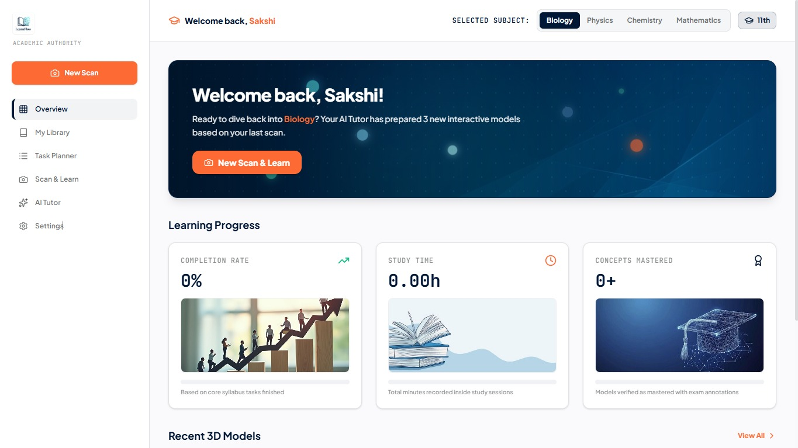
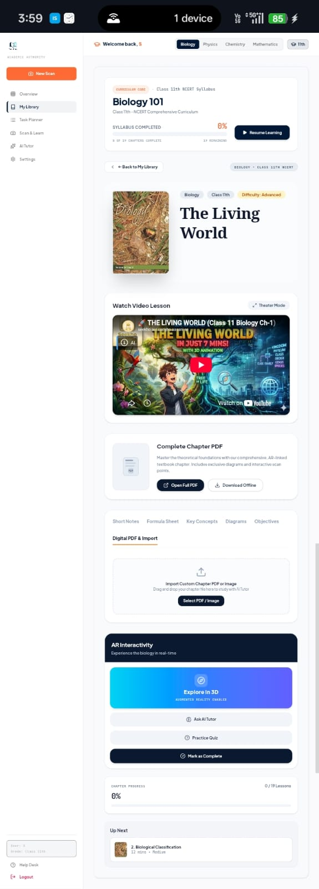

# 🚀 LearnFlow AR

LearnFlow AR is an AI-powered educational platform that transforms traditional textbook learning into interactive 3D and AI-assisted experiences. Built with modern web technologies, it combines Google Gemini AI, immersive concepts, and a responsive interface to make learning more engaging, intuitive, and effective.

---

## ✨ Features

- AI-powered learning assistant
- Interactive 3D visualization
- Textbook scanning
- Smart chapter explanations
- Responsive UI
- Fast performance
- Modular architecture
- Future-ready design

---

## 🛠 Tech Stack

### Frontend
- React
- TypeScript
- Vite
- Tailwind CSS

### Backend
- Firebase

### AI
- Google Gemini API

### Tools
- VS Code
- GitHub

---

## 📸 Screenshots

### Landing Page

### Dashboard

### Interface

---

## 🤝 Contributing

Contributions are welcome! If you would like to improve LearnFlow AR, feel free to fork the repository and submit a pull request.

---

## 👩‍💻 Developer

Created by Sakshi Patil

B.Tech Computer Science Engineering Student

Interested in:
- Artificial Intelligence
- Full Stack Development
- UI/UX Design
- Educational Technology

---

## 📄 License

MIT License
